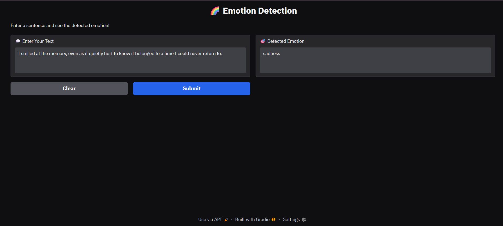

# Emotion Detection Using Natural Language Processing

# Introduction
Emotion and sentiment detection from text is widely used in areas like social media analysis, healthcare, and customer feedback.Traditional lexical-based methods are simple but struggle with nuances such as sarcasm and implicit meaning.This model uses advanced NLP techniques, combining **BERT** for contextual understanding and **BiLSTM** for sequential learning.The model improves accuracy in classifying emotions from textual data while handling complex language patterns.The model can be used for sentiment analysis, customer feedback analysis, and social media monitoring.

# Dataset
The Dataset used for this project is ISEAR Dataset which contains real-life emotional experience in text format labeled with 7 emotions such as: joy,sadness,anger,fear,disgust,shame,guilt.The dataset contains around 7517 rows.

# Model Architecture

# Methodology
Methodology used for this project involves the following steps:
1. Data Preprocessing: It involves cleaning the text like lowercasing,removing punctuation & stopwords, followed by tokenization.
2. Feature Extraction: For Feature extraction, contextual embeddings are generated using BERT, enabling the model to capture the meaning of words based on their context.
3. Model Training: A deep learning model is trained on the extracted features to predict the emotions expressed in a text. The model used for this project is BiLSTM.
4. Model Evaluation: The trained model is evaluated on the testing data to measure the accuracy,recall,F1-score and precision in detection emotions in the text. 

# Results
Accuracy: 97%
The model effectively captures contextual and sequential patterns, improving emotion classification performance.

